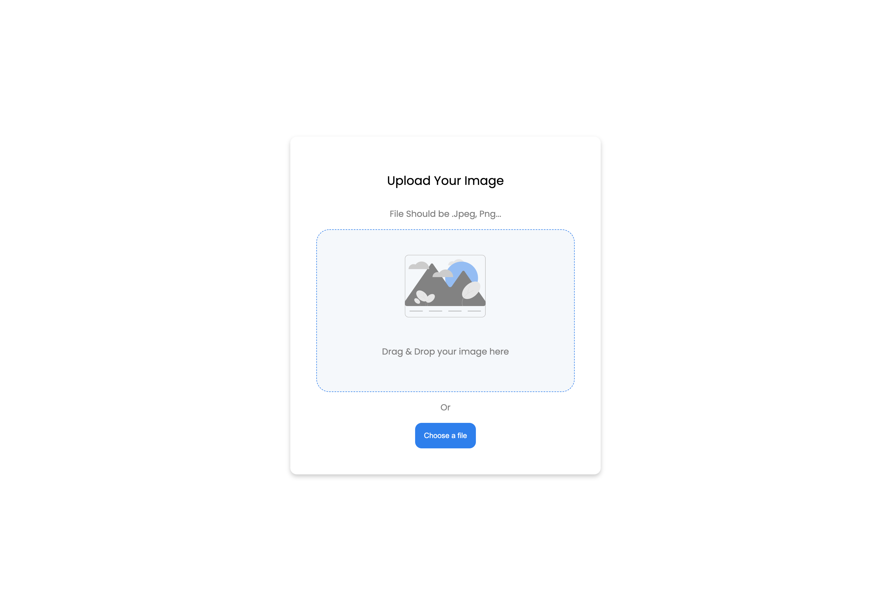

# Image Uploader

A simple image uploader built using the MERN stack. The idea and UI from [devchallenges](https://devchallenges.io/challenges/O2iGT9yBd6xZBrOcVirx)

## What I have Learned

-   using mongodb with mongoose
-   express
-   [multerjs](https://github.com/expressjs/multer) for image handling
-   `redirects`, `history`, `location`, in react router

## Screenshots

